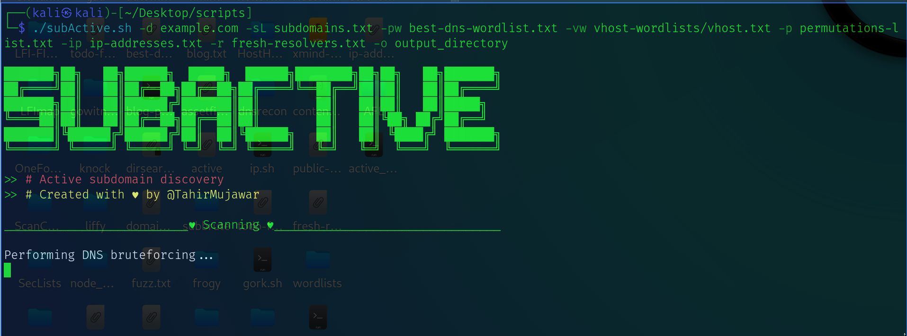

# about subActive

**subActive** is an efficient bash script for active subdomain enumeration, utilizing various tools to discover subdomains for specified domains. It supports DNS bruteforcing, permutation generation, web probing, and more, making it an essential tool for security researchers & cybersecurity professionals.


## Features




- **Active Subdomain Enumeration:** Utilizes various tools for active subdomain enumeration.
- **Comprehensive Subdomain Discovery:** Discovers subdomains for websites using multiple techniques.
- **Wordlist Customization:** Allows specifying wordlists for PureDNS and VHost, enhancing flexibility.
- **Permutations Generation:** Generates permutations for subdomains to expand search scope.
- **IP Address Resolution:** Resolves IP addresses for discovered subdomains.
- **DNS Bruteforcing:** Performs DNS bruteforcing to identify potential subdomains.
- **Web Probing:** Probes web services on discovered subdomains for further analysis.
- **Google Analytics Relationship Scan:** Scans for Google Analytics relationships to uncover related domains.
- **CSP and CNAME Analysis:** Conducts analysis using Content Security Policy (CSP) and CNAME records.
- **VHOST Bruteforcing:** Executes VHOST bruteforcing to identify virtual hosts.
- **Common Ports Scanning:** Scans common ports for web applications and services.
- **Integration with External Tools:** Integrates seamlessly with external tools like HostHunter and Gobuster.
- **Comprehensive Output:** Provides organized and comprehensive output for easy analysis.
- **Logging and Error Handling:** Implements logging and error handling mechanisms for smooth operation.
- **User-Friendly Interface:** Offers a user-friendly command-line interface with descriptive options.


## Installation


```bash
  git clone https://github.com/TheFellowHacker/subActive.git
  cd subActive
  chmod +x subActive
  ./subActive.sh -h
```
    
## Usage

```bash
./subActive.sh -h
SubActive is an active subdomain enumeration bash script that discovers subdomains for websites using various tools.

Usage: ./subActive.sh [options]

Options:
  -h, --help               Display this help message
  -d, --domain <name>      Specify a single domain name to enumerate its subdomains
  -sL, --subdomains-list   Specify a file containing a list of subdomains
  -pw, --wordlist <file>   Specify a wordlist for PureDNS
  -vw, --wordlist <file>   Specify a wordlist for VHost
  -p, --permuted-list <file> Specify a permutations list
  -ip, --ip-addresses <file> Specify a file containing IP addresses
  -r, --resolvers <file>   Specify a file containing DNS resolvers
  -o, --output <directory> Specify output directory (optional, if not specified, then a directory will be created with the domain name)

Example: ./subActive.sh -d example.com -sL <subdomain_list> -pw <puredns_wordlist> -vw <vhost_wordlist> -p permutations-list.txt -ip ip-addresses.txt -r fresh-resolvers.txt -o /path/to/output
```


## Notes
- All the options are required to run the script.
- It also requires ip-addresses.txt file to perform VHOST scan so first get Ip-addresses about the target by performing reverse-domain on the target.(or comment it out if you don't require this option)

## 🚀 About Me

Passionate cybersecurity enthusiast with a knack for scripting. Dedicated to developing tools for efficient subdomain enumeration and reconnaissance. Constantly exploring and innovating to enhance security practices.


## 🔗 Links
Follow me on 


<p align="center">
  <a href="https://www.linkedin.com/in/thefellowhacker"></a>
  <a href="https://medium.com/@thefellowhacker"></a>
  <a href="https://twitter.com/thefellowhacker"></a>
</p>
Made with ❤️ by Taahir Mujawarr
